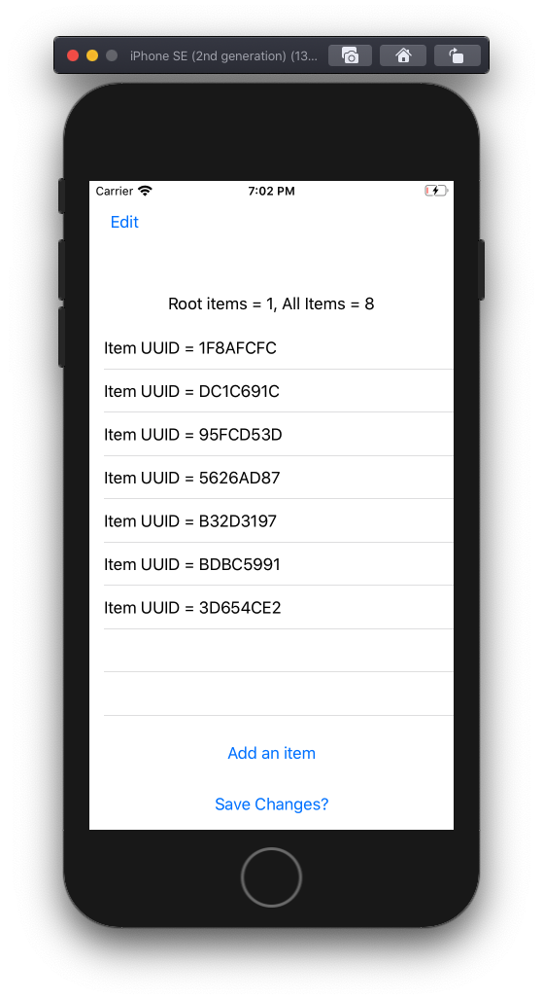
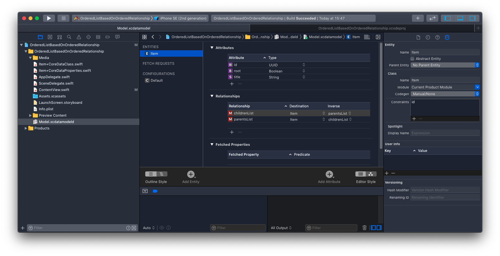
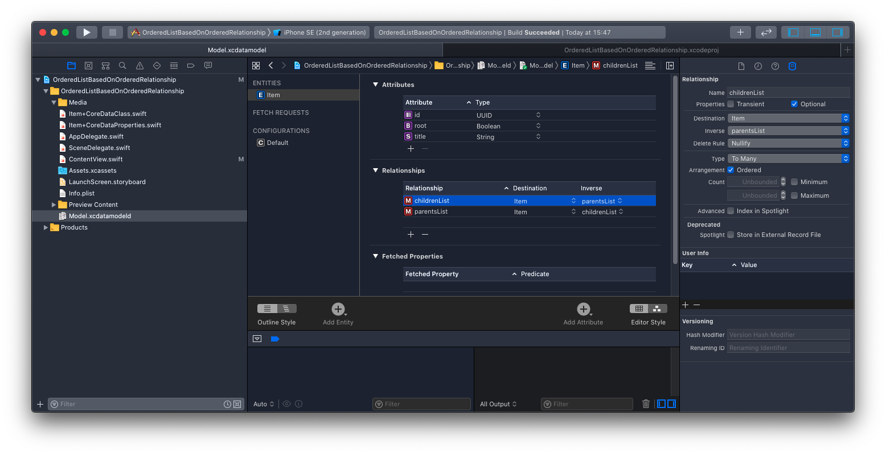

## Intro

This is an iOS SwiftUI app that demonstrates the ForEach component being used with a Core Data Entity that has a Many-to-Many relationship with itself **and** uses Xcode's data modeller Arrangement Ordered option to facilitate arbitrary ordering of those relationships. 

Why this rather than directly storing the order as a "priority" attribute on the entity? Storing as part of the relationship is more flexible; it allows ordering as part of many lists without requiring additional Entity "priority" attributes to be added for each list. 

**NB: Do not adopt this approach if intending to use CloudKit.** 

**CloudKit does not support the use of OrderedSets, see [here](https://stackoverflow.com/questions/69787646/core-data-storing-ordered-values-in-a-one-to-many-relationship) and [here](https://stackoverflow.com/questions/56967051/how-to-set-an-ordered-relationship-with-nspersistentcloudkitcontainer) for more on that**

## Installation

Works for me (tm) with Xcode 11.6 and iOS 13.5

## Running
Should run on any iOS 13.5+ simulator or device.

- Tap "Add an item" to add an item.
- Swipe left to delete an item.
- Tap "Edit" to delete and rearrange items and "Done" when finished.
- Tap "Save Changes?" to persist changes to Core Data backend.
- Uninstall to remove app and its data.

## Notes

### Data Model
There's only one Core Data entity called an `Item`. This Entity has:
- A title string 
- UUID attribute which it it constrained to be unique by.
- A Root flag boolean to indicate if the Item is the Root item from which all others are its children.
- childrenList and parentList relationships with itself that are the inverses of each other.
- It's been configured so that Codegen is manual.

The `Arrangement Ordered` option has been ticked for the children and parent relationships. Which, according to official [documentation](https://developer.apple.com/documentation/coredata/modeling_data/configuring_relationships) does the following: *"Arrangement: Select the Ordered checkbox to specify that the relationship has an inherent ordering, and to generate an ordered **mutable** set."*. 

The `Editor> Create NSManagedObjectSubclass Subclass...` was then used to make the Core Data class boiler plate easier to inspect and play with (not that I did much of that). This is in `Item+CoreDataClass.swift` and `Item_CoreDataProperties.swift`

### Bug?
I think either the official documentation might be wrong or the code created by `Editor> Create NSManagedObjectSubclass Subclass...` is a bit broken. As for both the parent and children lists, the generated code it produces in `Item_CoreDataProperties.swift` ends up using the **immutable** `NSOrderedSet` type (and not a **mutable** type such as `NSMutableOrderedSet`that the documentation suggests it should be). 

I tried working around this by casting to a mutable `NSMutableOrderedSet`, but the framework does not recognise the changes and silently drops them. There's a copy of this attempt commented out in the code.  In the end what did work was to create a copy of the list to a`NSMutableOrderedSet`, reorder and then replacing. 

If I can clarify further I will update here.
